# Comparison on different algorithms for electron/pion discrimination

## 1. Introduction  

The goal of this study is to compare the identification perfomance of different types of algorithms for discriminating electrons and pions in HGCAL. This analysis is made by training BDT's on the simulated DATA obtained through those algorithms.  
Here are the algorithms that we will compare:  
* ThresholdRef2dRef3dGenclusters (T23) is the old algorithm used by creating 2D clusters first then reconstructing 3D clusters
* SupertriggercellDummyHistomaxClusters (SDH)
* SupertriggercellDummyHistomaxvardrth0Clusters (SDH0)
* SupertriggercellDummyHistomaxvardrth10Clusters (SDH10)
* SupertriggercellDummyHistomaxvardrth20Clusters (SDH20)
* ThresholdDummyHistomaxClusters (TDH)
* ThresholdDummyHistomaxvardrth0 (TDH0)
* ThresholdDummyHistomaxvardrth10 (TDH10)
* ThresholdDummyHistomaxvardrth20 (TDH20)

The data are found in root files at <https://cernbox.cern.ch/index.php/s/Mr9t9Fn4VyDfB4p>

## 2. Preprocessing
The files need to be preprocessed. The code to do so is found in this [notebook](preprocessing.ipynb). For each algorithm there is a file (actually multiple files that need to be fused) containing multiple entries. Each entry corresponds to a cluster reconstructed by the algorithms with several variables noted 'cl3d_\*'. In the T23 file are also entries corresponding to the true generated DATA.

The raw files contain an entry for every particle created during the simulation. The first step of preprocessing is then to cut every entry for which the particle was not one of the two mother particles or didn't reach the endcap.  
Once this is done, we proceed to match the reconstructed clusters to a generated particle. To this end, we calculate the deltar for the between the generatedd particle and every candidate cluster, then select the highest pt candidate with deltar \< threshold (0.05)

## 3. Analysis and BDT
The BDT analysis is realised in this [notebook](BDT.ipynb).

Before training our BDTs, we cut our data under 10 pt and keep only 1.6 \< eta\< 2.9 to only use the clearest data, the reconstruction efficiency falling under those cuts.

Then, we get a more in-depth look at the distribution of the variables of interest for us (those we will use as features for BDT):
* eta
* longitudinal variables: shower length, core shower length, first layer, maw layer, szztot
* form factors: srrmean, srrtot, seetot, spptot  

Here are the correlation matrices for signal (electron) and background (pions) for every algorithms:
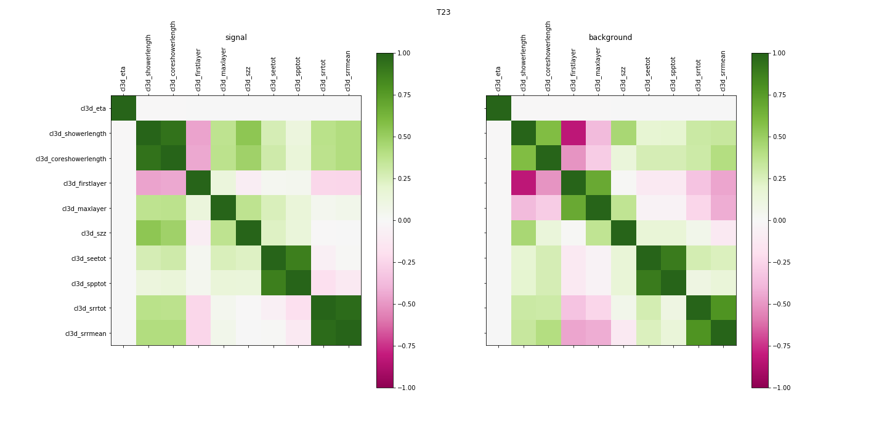
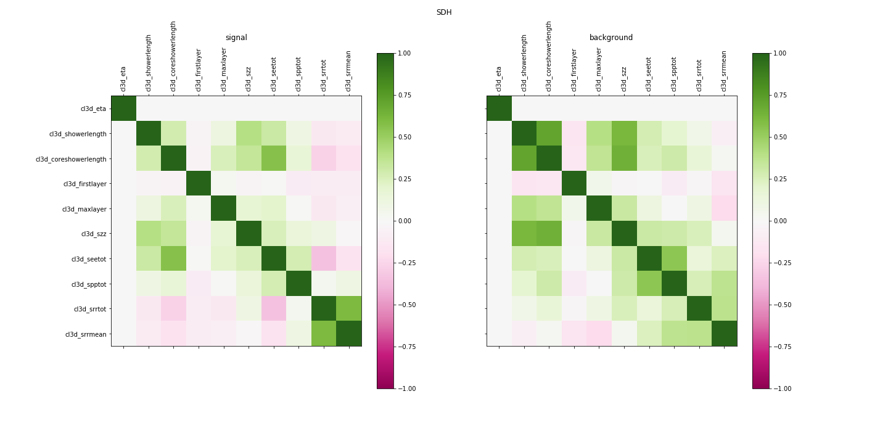
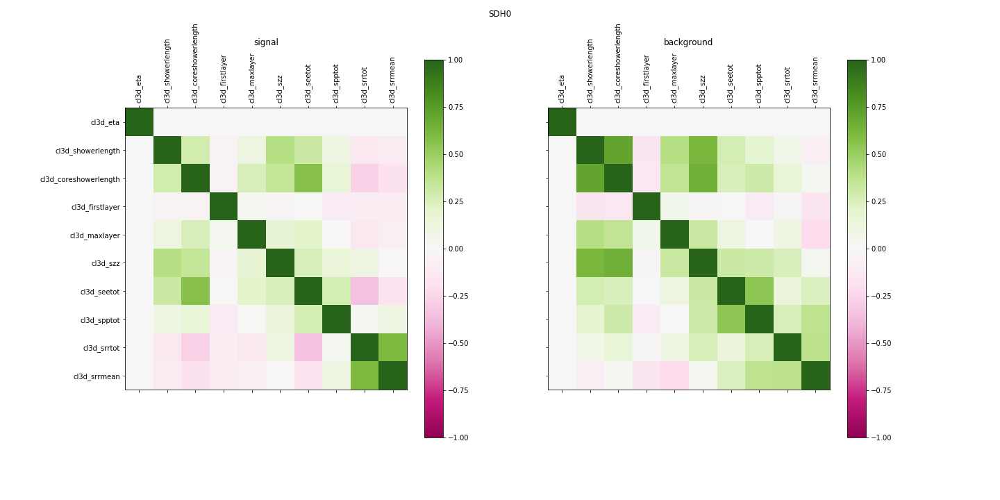

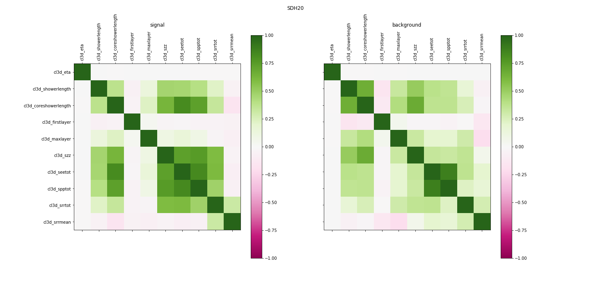

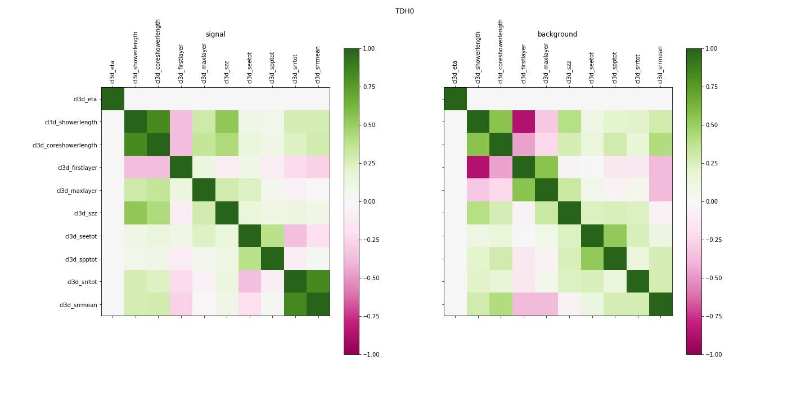
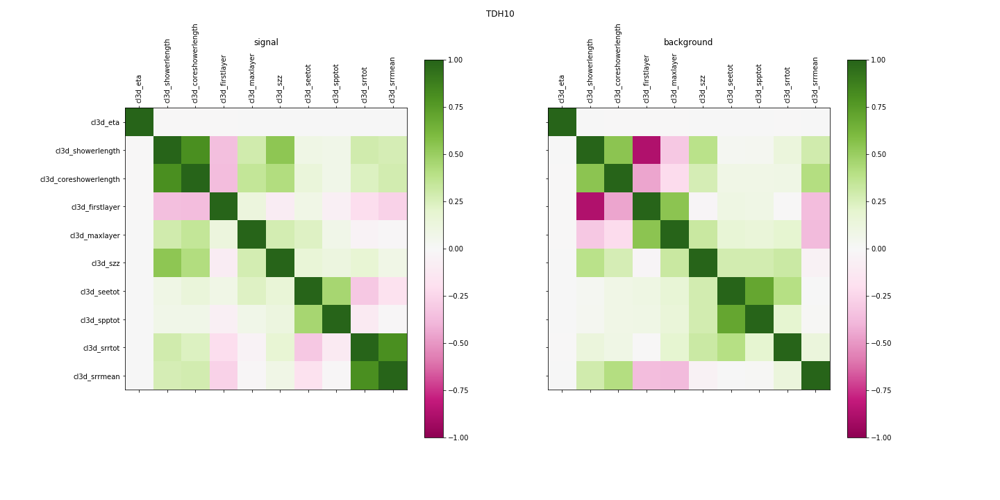
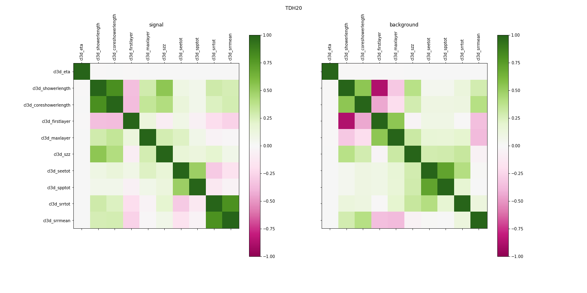

And violin plots representing the distribution of the variables across the differents algorithms for electrons and pions:  
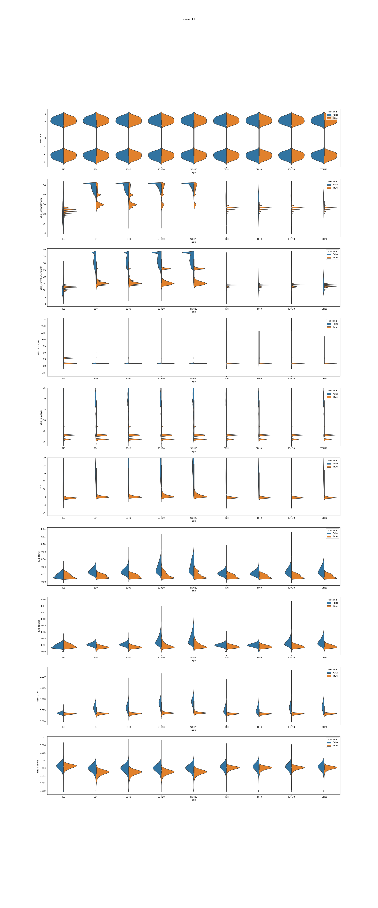

We can now train our BDT using XGBoost library and the following parameters:
    
    param['nthread']          = 30  # limit number of threads
    param['eta']              = 0.1 # learning rate
    param['max_depth']        = 10  # maximum depth of a tree
    param['subsample']        = 0.8 # fraction of events to train tree on
    param['colsample_bytree'] = 0.8 # fraction of features to train tree on
    param['silent'] = True
    param['objective']   = 'binary:logistic' # objective function
    param['eval_metric'] = 'error'           # evaluation metric for cross validation
    param = list(param.items()) + [('eval_metric', 'logloss')] + [('eval_metric', 'rmse')]
    num_trees = 100  # number of trees to make

We can now take a look at the predictions from the BDTs against true value;
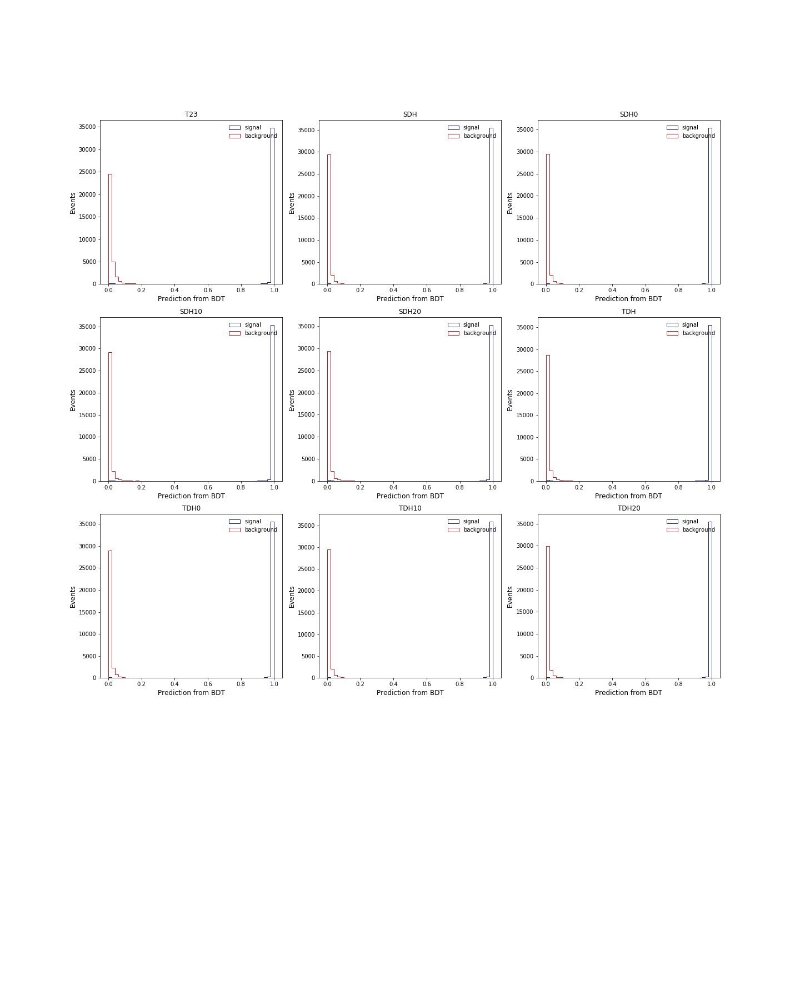
And the imporantce of each variable (as mode: gain to show the discriminating power of the variable)
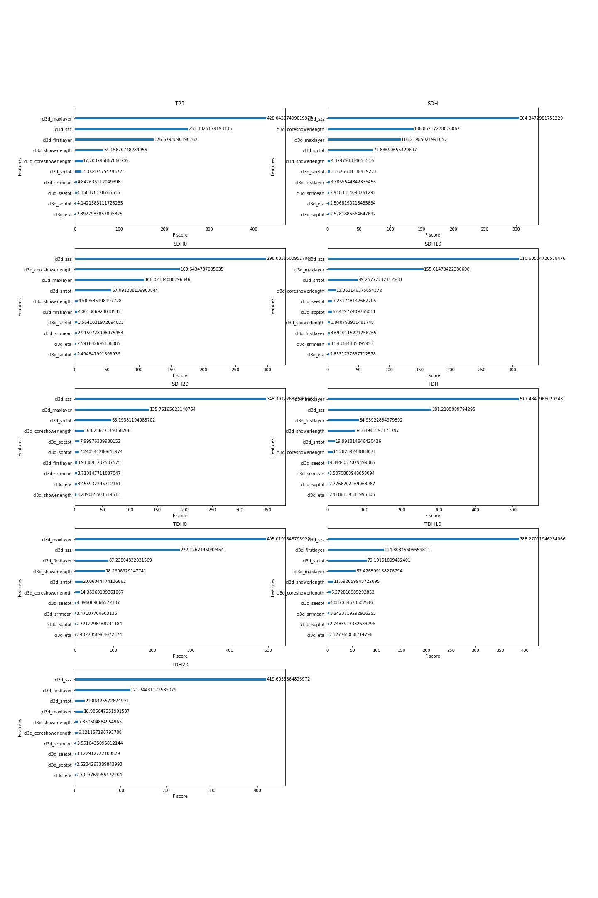

We can now plot the ROC curve for the algorithms:
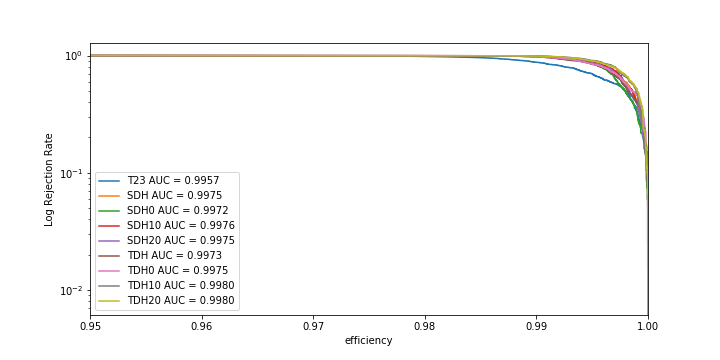
We can see that without Pileup, the efficiency is extremely high, we then pick a working point of 0.995 efficiency that is way higher than whate we expect to keep in heavy pileup situation.

To compare the algorithms we decide to use the background efficiency as scoring: at our working point, it is the percentage of backgroung (here pions) that are incorrectly identified as signal, closest to 0 is better)
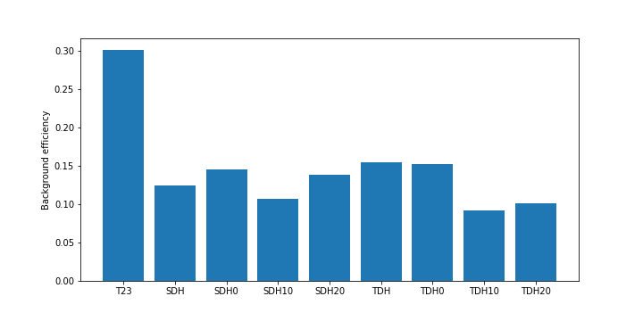

As a bonus, the T23 files contained old data for BDT trained with other methods, here is a comparison between our results and those
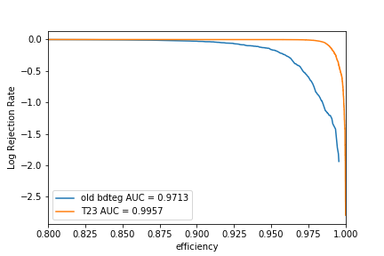

We now want ot take in depth look at our BDT efficiency vs bins of pt and eta, with error bars corresponding to the clopper-pearson measur of uncertainties for a confidence level of 99% and a working point of 0.95 (more in agreement to what we expect to keep in presence of pilup). Theplots are rendered raw and with logarithmic scale to better see the close 0 variations:
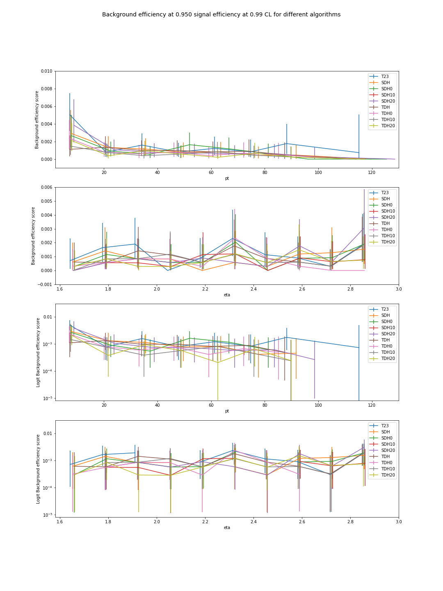

